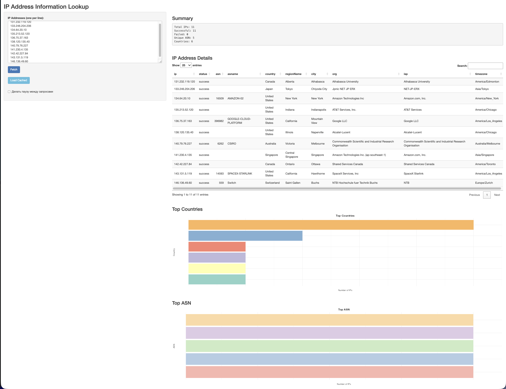

# yisasnxlooukup

R-пакет для получения информации об IP-адресах через API ip-api.com с визуализацией в Shiny.



**GitHub:** [https://github.com/FrakenboK/RPRoject](https://github.com/FrakenboK/RPRoject)

## Установка

### Из GitHub

```r
remotes::install_github("FrakenboK/RPRoject")
```

**Примечание:** Если у вас не установлен пакет `remotes`, сначала установите его:

```r
install.packages("remotes")
```

### Из локальной директории (для разработки)

```r
devtools::install()
```

или

```r
devtools::load_all()
```

## Использование

После установки пакет импортируется стандартным способом:

```r
library(yisasnxlooukup)
```

### Быстрая установка и запуск

```r
# Установка из GitHub
if (!requireNamespace("remotes", quietly = TRUE)) {
  install.packages("remotes")
}
remotes::install_github("FrakenboK/RPRoject")

# Загрузка пакета
library(yisasnxlooukup)

# Запуск приложения
run_app()
```

Доступные функции:
- `fetch_ip_api()` - получение данных об IP-адресах
- `prepare_ipinfo()` - нормализация данных
- `calc_ip_metrics()` - расчет метрик
- `run_app()` - запуск Shiny приложения

## Быстрый старт (R)

### Запуск Shiny приложения

```r
library(yisasnxlooukup)
run_app()
```

Или с параметрами:

```r
run_app(host = "0.0.0.0", port = 3838)
```

После запуска:
1. Введите IP-адреса в текстовое поле (по одному на строку)
2. Нажмите кнопку **"Fetch"** для получения данных через API
3. Результаты отобразятся в таблице и на графиках

**Примечание**: Кэш (кнопка "Load Cached") - опциональная функция. Основная работа идет через "Fetch" в UI.

### Использование API-функций (без UI)

```r
library(yisasnxlooukup)

ips <- c("8.8.8.8", "1.1.1.1")
raw <- fetch_ip_api(ips)
df <- prepare_ipinfo(raw)
metrics <- calc_ip_metrics(df)

print(metrics$summary)
print(metrics$by_country)
```

## Примечания

- При использовании функции `fetch_ip_api()` выполняются реальные HTTP-запросы к внешнему API ip-api.com
- Учтите лимиты внешнего API при работе с большим количеством IP-адресов
- Рекомендуется использовать опцию паузы между запросами для соблюдения rate limits

## Основные функции

| Функция | Описание |
|---------|----------|
| `fetch_ip_api(ips, ...)` | Получение данных об IP-адресах через API ip-api.com |
| `prepare_ipinfo(df_raw)` | Нормализация и очистка сырых данных |
| `calc_ip_metrics(df_clean)` | Расчет метрик и агрегатов (по странам, ASN) |
| `run_app(...)` | Запуск Shiny веб-приложения для визуализации |

### Примеры использования

```r
library(yisasnxlooukup)

# Получение информации об IP
result <- fetch_ip_api("8.8.8.8")

# Обработка данных
clean_data <- prepare_ipinfo(result)

# Расчет статистики
stats <- calc_ip_metrics(clean_data)
stats$summary
stats$by_country
stats$by_asn
```

## Два мира данных

Проект использует две зоны данных:

### 1) `raw-data/` (кухня для разработчика)
Эта папка коммитится в репозиторий и содержит:
- Исходные выгрузки и дампы (CSV, JSON)
- Промежуточные файлы
- R-скрипты подготовки данных
- Заметки и черновики

**Важно**: Содержимое `raw-data/` не используется напрямую Shiny приложением или дашбордом.

### 2) `data/` (рабочее хранилище рантайма)
Эта папка **не коммитится** (в `.gitignore`) и используется для:
- Кэширования результатов ETL
- Хранения обработанных данных (`.rds` файлы)
- Сохранения данных между перезапусками приложения

В Docker эта папка монтируется как volume: `./data:/srv/ourpack/data`

## Docker

### Запуск через Docker Compose

#### Запуск Shiny приложения (основной способ)
```bash
docker compose up app
```

Приложение будет доступно по адресу: http://localhost:3838

#### Запуск ETL (загрузка данных, опционально)
```bash
docker compose run --rm etl
```

Список IP можно задать через переменную окружения:
```bash
IP_LIST="8.8.8.8,1.1.1.1,208.67.222.222" docker compose run --rm etl
```

### Запуск через Docker (без compose)

#### Сборка образа
```bash
docker build -f docker/Dockerfile -t yisasnxlooukup .
```

#### Запуск ETL
```bash
docker run --rm -v $(pwd)/data:/srv/ourpack/data \
  -e OURPACK_DATA_DIR=/srv/ourpack/data \
  -e IP_LIST="8.8.8.8,1.1.1.1" \
  yisasnxlooukup Rscript docker/run_etl.R
```

#### Запуск Shiny приложения
```bash
docker run -p 3838:3838 \
  -v $(pwd)/data:/srv/ourpack/data \
  -e OURPACK_DATA_DIR=/srv/ourpack/data \
  yisasnxlooukup
```

## Использование кэша в Shiny

Shiny приложение автоматически пытается загрузить кэшированные данные при старте (если файлы существуют в `data/`).

Также доступна кнопка **"Load Cached"** для ручной загрузки данных из кэша.

Если кэша нет, приложение работает как обычно: ввод IP-адресов и кнопка "Fetch" для запроса данных через API.

## Тестовые данные

В папке `raw-data/` находится файл `test_ips.csv` с набором тестовых IP-адресов для проверки функциональности пакета.

### Загрузка IP-адресов из CSV

В Shiny приложении доступна функция загрузки IP-адресов из CSV файла:

1. Нажмите кнопку **"Choose CSV File"** в интерфейсе
2. Выберите CSV файл с IP-адресами (формат: одна колонка `ip` или просто список IP-адресов по одному на строку)
3. IP-адреса автоматически загрузятся в текстовое поле
4. Нажмите **"Fetch"** для получения данных

### Формат CSV файла

CSV файл может иметь один из следующих форматов:

**Вариант 1:** С заголовком
```csv
ip
8.8.8.8
1.1.1.1
208.67.222.222
```

**Вариант 2:** Без заголовка (просто список IP-адресов)
```csv
8.8.8.8
1.1.1.1
208.67.222.222
```

### Использование тестовых данных

```r
library(yisasnxlooukup)

# Чтение тестовых IP из CSV
test_ips <- read.csv("raw-data/test_ips.csv", stringsAsFactors = FALSE)
ips <- test_ips$ip

# Получение данных
raw <- fetch_ip_api(ips)
df <- prepare_ipinfo(raw)
metrics <- calc_ip_metrics(df)
```

## Экспорт данных

Shiny приложение поддерживает экспорт данных в CSV формат:

1. После загрузки данных (через "Fetch" или "Load Cached")
2. Нажмите кнопку **"Download CSV"**
3. Файл будет скачан с текущими данными из таблицы

Экспортированный CSV содержит все поля из таблицы IP-адресов, включая:
- IP-адрес
- Страна
- Город
- ASN
- Широта и долгота
- Временная зона
- ISP
- Организация
- Время запроса

## Структура проекта

```
yisasnxlooukup/
├── R/                      # Исходный код R-функций
│   ├── fetch_ip_api.R      # Функция запросов к API
│   ├── prepare_ipinfo.R    # Нормализация данных
│   ├── calc_ip_metrics.R   # Расчет метрик
│   └── run_app.R           # Запуск Shiny приложения
├── inst/
│   └── shinyapp/
│       └── app.R           # Shiny UI и server логика
├── docker/
│   ├── Dockerfile          # Docker образ
│   └── run_etl.R           # ETL скрипт
├── raw-data/               # Тестовые данные и дампы
│   └── test_ips.csv        # Тестовые IP-адреса
├── tests/                  # Тесты
│   ├── testthat.R          # Настройка testthat
│   └── testthat/           # Тестовые файлы
│       ├── test-api.R      # Тесты для fetch_ip_api()
│       └── test-data-processing.R  # Тесты для prepare_ipinfo() и calc_ip_metrics()
├── data/                   # Кэш данных (не коммитится)
├── DESCRIPTION             # Метаданные пакета
├── NAMESPACE               # Экспортируемые функции
├── docker-compose.yml      # Docker Compose конфигурация
├── quick_start.R           # Скрипт быстрого запуска
└── README.md               # Документация
```

## Зависимости

Пакет требует следующие R-пакеты:

- **shiny** - веб-фреймворк для интерактивных приложений
- **httr2** - HTTP клиент для запросов к API
- **jsonlite** - парсинг JSON ответов
- **dplyr** - манипуляции с данными
- **tidyr** - трансформация данных
- **stringr** - работа со строками
- **ipaddress** - валидация IP-адресов
- **ggplot2** - построение графиков
- **DT** - интерактивные таблицы
- **lubridate** - работа с датами и временем
- **RColorBrewer** - цветовые палитры для графиков
- **testthat** - фреймворк для тестирования (для разработки)

Все зависимости устанавливаются автоматически при установке пакета.

## API лимиты

При работе с API ip-api.com учитывайте следующие ограничения:

- **Бесплатный план:** 45 запросов в минуту
- **HTTP запросы:** Рекомендуется использовать HTTP (не HTTPS) для бесплатного плана
- **Rate limiting:** При превышении лимита API возвращает ошибку 429

Рекомендации:
- Используйте опцию паузы между запросами (`sleep_sec` параметр)
- Для больших объемов данных используйте кэширование
- Рассмотрите возможность использования платного плана API

## Устранение неполадок

### Проблема: Приложение не запускается

**Решение:**
1. Убедитесь, что все зависимости установлены: `install.packages(c("shiny", "httr2", "jsonlite", "dplyr", "tidyr", "stringr", "ipaddress", "ggplot2", "DT", "lubridate", "RColorBrewer"))`
2. Проверьте, что пакет установлен: `devtools::install()`
3. Запустите `devtools::document()` для генерации NAMESPACE

### Проблема: API возвращает ошибки

**Решение:**
1. Проверьте интернет-соединение
2. Убедитесь, что IP-адреса валидны
3. Проверьте, не превышен ли лимит запросов (45/мин для бесплатного плана)
4. Попробуйте увеличить паузу между запросами

### Проблема: Docker образ не собирается

**Решение:**
1. Убедитесь, что Docker запущен
2. Проверьте, что Dockerfile находится в правильной директории
3. Для Apple Silicon используйте `--platform=linux/amd64` флаг
4. Очистите кэш Docker: `docker system prune -a`

### Проблема: Данные не сохраняются в кэш

**Решение:**
1. Проверьте права доступа к директории `data/`
2. Убедитесь, что переменная окружения `OURPACK_DATA_DIR` установлена правильно
3. В Docker проверьте, что volume смонтирован корректно

## Разработка

### Локальная разработка

```r
# Клонирование репозитория
git clone https://github.com/FrakenboK/RPRoject.git
cd RPRoject

# Установка в режиме разработки
devtools::load_all()

# Генерация документации
devtools::document()

# Запуск тестов
devtools::test()
```

### Добавление новых функций

1. Создайте новый файл в `R/` с именем функции
2. Добавьте Roxygen2 документацию
3. Запустите `devtools::document()` для обновления NAMESPACE
4. Обновите `DESCRIPTION` при необходимости

## Тестирование

Пакет включает набор тестов на основе `testthat` для проверки функциональности основных функций.

### Запуск тестов

Для запуска всех тестов используйте:

```r
devtools::test()
```

Или напрямую через `testthat`:

```r
library(testthat)
test_dir("tests/testthat")
```

### Структура тестов

Тесты организованы в два файла:

1. **`tests/testthat/test-data-processing.R`** - тесты для функций обработки данных:
   - `prepare_ipinfo()` - проверка нормализации данных, обработки ASN, удаления дубликатов, обработки пустых строк
   - `calc_ip_metrics()` - проверка расчета метрик, группировки по странам и ASN, фильтрации данных

2. **`tests/testthat/test-api.R`** - тесты для функции API:
   - `fetch_ip_api()` - проверка валидации входных параметров, обработки невалидных IP, удаления дубликатов, структуры возвращаемых данных

### Покрытие тестами

Тесты покрывают следующие сценарии:

- Валидация входных параметров
- Обработка корректных и некорректных данных
- Нормализация и очистка данных
- Расчет метрик и агрегатов
- Обработка граничных случаев (пустые данные, дубликаты, отсутствующие колонки)
- Обработка ошибок сети и таймаутов

**Примечание:** Тесты, которые выполняют реальные HTTP-запросы к внешнему API, помечены `skip_on_cran()` и пропускаются при проверке на CRAN для избежания проблем с rate limits и зависимостями от внешних сервисов.

### Добавление новых тестов

При добавлении новых функций рекомендуется также добавить соответствующие тесты:

1. Создайте файл `tests/testthat/test-<function_name>.R` или добавьте тесты в существующий файл
2. Используйте стандартные функции `testthat`: `test_that()`, `expect_*()`
3. Запустите тесты для проверки: `devtools::test()`

## Лицензия

Проект распространяется под лицензией MIT.

## Вклад в проект

Мы приветствуем вклад в развитие проекта! Пожалуйста:

1. Создайте fork репозитория
2. Создайте ветку для новой функции (`git checkout -b feature/amazing-feature`)
3. Внесите изменения и закоммитьте (`git commit -m 'Add amazing feature'`)
4. Отправьте изменения (`git push origin feature/amazing-feature`)
5. Создайте Pull Request

## Контакты и поддержка

Если у вас возникли вопросы или проблемы:

- Создайте Issue на GitHub: [https://github.com/FrakenboK/RPRoject/issues](https://github.com/FrakenboK/RPRoject/issues)
- Проверьте существующие Issues перед созданием нового

## История версий

### Версия 1.0.0
- Базовая функциональность запросов к API ip-api.com
- Shiny приложение с визуализацией
- Поддержка кэширования данных
- Docker контейнеризация
- Экспорт данных в CSV
- Загрузка IP-адресов из CSV файлов

## API Documentation

### fetch_ip_api()

Функция `fetch_ip_api()` выполняет запросы к API ip-api.com для получения информации об IP-адресах.

#### Параметры:
- `ips`: Вектор символьных значений с IP-адресами (IPv4/IPv6)
- `fields`: Строка с полями, которые нужно получить из API (по умолчанию: "status,as,lat,lon,timezone,asname,city,regionName,org,country,isp,message")
- `base_url`: Базовый URL API (по умолчанию: "http://ip-api.com/json")
- `timeout_sec`: Таймаут для HTTP-запросов в секундах (по умолчанию: 10)
- `sleep_sec`: Пауза между запросами в секундах (по умолчанию: 0)

#### Возвращаемые значения:
Функция возвращает tibble с одной строкой на каждый IP-адрес, содержащий данные из API:
- `ip`: IP-адрес
- `status`: Статус запроса ("success" или "fail")
- `as`: ASN в формате "AS12345"
- `lat`, `lon`: Географические координаты
- `timezone`: Часовой пояс
- `asname`: Название автономной системы
- `city`: Город
- `regionName`: Регион
- `org`: Организация
- `country`: Страна
- `isp`: Интернет-провайдер
- `message`: Сообщение об ошибке (если статус "fail")
- `lookup_ts`: Время выполнения запроса

#### Пример:
```r
library(yisasnxlooukup)
ips <- c("8.8.8.8", "1.1.1.1")
result <- fetch_ip_api(ips)
```

### prepare_ipinfo()

Функция `prepare_ipinfo()` нормализует и очищает сырые данные, полученные от API.

#### Параметры:
- `df_raw`: Необработанный data frame из `fetch_ip_api()`

#### Возвращаемые значения:
Функция возвращает нормализованный tibble со стандартизированными колонками и типами данных.

#### Пример:
```r
library(yisasnxlooukup)
raw <- fetch_ip_api(c("8.8.8.8"))
df <- prepare_ipinfo(raw)
```

### calc_ip_metrics()

Функция `calc_ip_metrics()` рассчитывает метрики и агрегаты на основе очищенных данных.

#### Параметры:
- `df_clean`: Очищенный data frame из `prepare_ipinfo()`

#### Возвращаемые значения:
Функция возвращает список с элементами:
- `summary`: tibble с общими метриками
- `by_country`: Подсчет IP-адресов по странам
- `by_asn`: Подсчет IP-адресов по ASN/asname
- `geo_ok`: Строки с действительными координатами для картографирования

#### Пример:
```r
library(yisasnxlooukup)
df <- prepare_ipinfo(fetch_ip_api(c("8.8.8.8", "1.1.1.1")))
metrics <- calc_ip_metrics(df)
print(metrics$summary)
print(metrics$by_country)
```

## TODO: Улучшения безопасности

### Аутентификация и авторизация
- [ ] **Добавить аутентификацию для Shiny приложения**: Реализовать login/logout систему
- [ ] **RBAC (Role-Based Access Control)**: Разделить права доступа (admin/user/guest)
- [ ] **API ключи для пользователей**: Персональные ключи для отслеживания использования
- [ ] **Логирование активности пользователей**: Записывать все действия пользователей

### Защита данных
- [ ] **Шифрование кэша**: Зашифровать данные в директории `data/`
- [ ] **Очистка чувствительных данных**: Автоматическое удаление старых кэшей
- [ ] **Masking данных**: Скрытие части IP-адресов в логах и выводе
- [ ] **HTTPS только**: Принудительное использование HTTPS в production

### Docker Security
- [ ] **Non-root пользователь**: Запускать контейнер от непривилегированного пользователя
- [ ] **Read-only файловая система**: Сделать root filesystem read-only
- [ ] **Удалить ненужные зависимости**: Минимизировать количество установленных пакетов
- [ ] **Security scanning**: Добавить сканирование уязвимостей в CI/CD pipeline
- [ ] **Network policies**: Ограничить сетевые подключения контейнера

### API Security
- [ ] **Proxy для внешних API**: Не позволять прямые вызовы к ip-api.com из клиента
- [ ] **Caching sensitive responses**: Не кэшировать данные содержащие персональную информацию
- [ ] **Request sanitization**: Очистка всех параметров перед отправкой во внешние сервисы
- [ ] **Timeout handling**: Добавить таймауты для предотвращения DoS атак

### Input Validation
- [ ] **CSV file validation**: Проверка содержимого загружаемых CSV файлов
- [ ] **Size limits for uploads**: Ограничить размер загружаемых файлов (например, 10MB)
- [ ] **Content-Type checking**: Проверка MIME типов загружаемых файлов
- [ ] **Malware scanning**: Сканирование загружаемых файлов (при интеграции с антивирусом)
